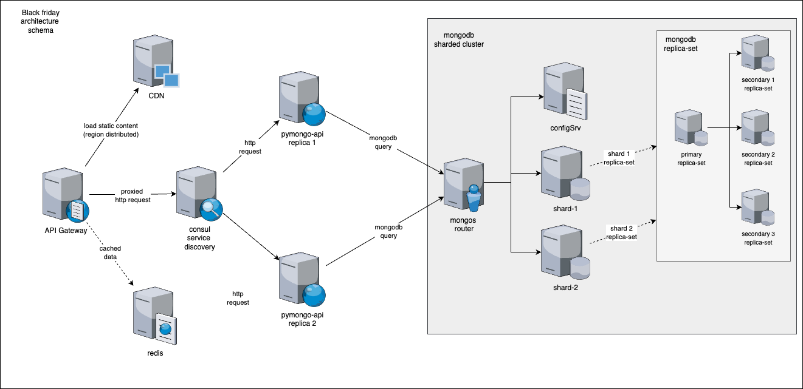

# pymongo-api

Итоговая реализация выглядит следующим образом:



Для каждого из этапа выполнения задания была создана дополнительная директория с решением и конфигурацией запуска:
   1. текущая директория с исходным решением;
   2. `mongo-sharding` директория с конфигурацией `mongodb` в режиме `sharded cluster`;
   3. `mongo-sharding-repl` директория с конфигурацией репликаций `mongodb` для каждой партиции;
   4. `sharding-repl-cache` директория со всеми предудыщими конфигурациями + настройка кэширования.

## Как запустить

Перейдите в директорию для соответствующего этапа и запустите `docker-compose`. К примеру, для последнего этапа
`sharding-repl-cache` команда запуска будет выглядить следующим образом:

```shell
cd sharding-repl-cache
docker compose up -d --build
```

Далее необходимо запустить скрипт инициализации `mongodb`, который выполняет настройку и подключения `sharding` и 
`replica set`. Скрипт `shard-cluster-init.sh` находится в каждой директории этапа, и **запуск скрипта должен производиттся
из директории текущего этапа**. Запуск производится по следующей команде:

```shell
/bin/bash ./shard-cluster-init.sh
```

Последним этапом является заполние данными `mongodb`. Для этого необходимо запустить скрипт, находящийся в корневой 
директории: `./scripts/mongo-init.sh`, который заполняет `helloDoc` коллекцию в `somedb`.  

```shell
/bin/bash ../scripts/mongo-init.sh
```

## Как проверить

### Если вы запускаете проект на локальной машине

Откройте в браузере http://localhost:8080

### Если вы запускаете проект на предоставленной виртуальной машине

Узнать белый ip виртуальной машины

```shell
curl --silent http://ifconfig.me
```

Откройте в браузере http://<ip виртуальной машины>:8080

## Доступные эндпоинты

Список доступных эндпоинтов, swagger http://<ip виртуальной машины>:8080/docs
